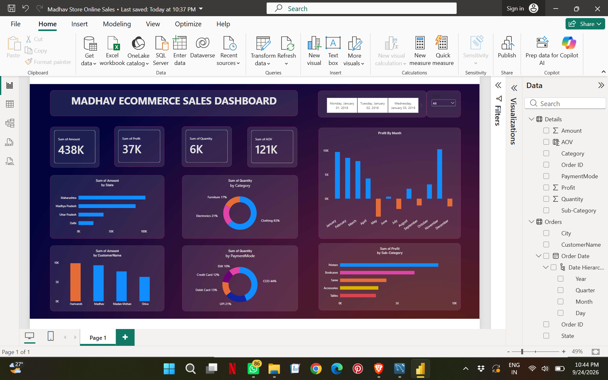

# 📊 Madhav Ecommerce Sales Dashboard — Power BI

An interactive Power BI dashboard developed to analyze ecommerce sales performance, profitability, product categories, customer behavior, payment methods, and geographic performance.

---

## 🎯 Project Objective

The objective of this project is to transform ecommerce sales data into an interactive business intelligence dashboard that helps analyze:

- Overall sales performance
- Profitability
- Quantity sold
- Average Order Value
- Monthly profit trends
- State-wise sales
- Category performance
- Customer-wise sales
- Payment method distribution
- Sub-category profitability

---

## 🛠️ Tools & Skills

| Category | Tools / Skills |
|---|---|
| BI Tool | Microsoft Power BI |
| Data Analysis | Data Cleaning & Transformation |
| Data Modeling | Data Relationships & Hierarchies |
| Visualization | Power BI Charts & KPI Cards |
| Interactivity | Slicers & Filters |
| Analysis | Sales & Profit Analysis |
| Business Intelligence | Dashboard Development |

---

## 📊 Dashboard

The dashboard provides an interactive overview of ecommerce sales and profitability using KPI cards, charts, filters and visualizations.

### Dashboard Components

- 💰 Total Sales / Amount
- 📈 Total Profit
- 📦 Total Quantity
- 🧾 Average Order Value
- 📅 Profit by Month
- 🗺️ Sales by State
- 🛍️ Quantity by Category
- 👤 Sales by Customer
- 💳 Quantity by Payment Mode
- 📊 Profit by Sub-Category
- 🔎 Date and State filters

---

## 🔍 Key Insights

Based on the dashboard:

- Total sales amount is approximately **438K**.
- Total profit is approximately **37K**.
- Approximately **6K units** were sold.
- **Clothing** represents the largest share of quantity among the displayed product categories.
- **COD** represents the largest share among the displayed payment methods.
- **Maharashtra** has the highest sales amount among the displayed states.
- **Printers** generate the highest profit among the displayed sub-categories.
- Monthly profit varies considerably throughout the year, with positive and negative profit months visible in the dashboard.

---

## 💡 Business Questions Answered

This dashboard helps answer questions such as:

1. What is the overall sales and profit performance?
2. How does profit change across different months?
3. Which states generate the highest sales?
4. Which product categories contribute the most quantity?
5. Which customers generate the highest sales?
6. Which payment methods are most frequently used?
7. Which sub-categories generate the highest profit?
8. How does performance change based on date and state filters?

---

## 📂 Project Files

| File | Description |
|---|---|
| `Madhav_Ecommerce_Sales_Dashboard.pbix` | Power BI project containing the dashboard and analysis |
| `images/dashboard.png` | Dashboard preview |

---

## 🚀 Skills Demonstrated

- Microsoft Power BI
- Data Cleaning
- Data Transformation
- Data Analysis
- Data Visualization
- Dashboard Development
- KPI Development
- Business Intelligence
- Customer Analysis
- Sales Analysis
- Profitability Analysis
- Interactive Reporting

---

## 📌 Project Type

**Data Analytics | Power BI | Business Intelligence | Dashboard**

---

## 👩‍💻 Author

**Bhavya Verma**

GitHub: [@Rumi004](https://github.com/Rumi004)
